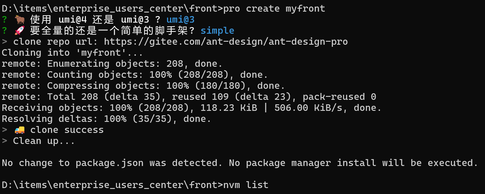

# 企业用户中心项目—— Ant Design Pro 项目模板 Umi 3 开发框架

`3版本-官方文档：` https://pro.ant.design/zh-CN/docs/getting-started/

## 项目简介-本项目的完整业务流程?

一个企业中最最最常用的系统 —— `用户中心` ，简单的 “用户管理系统” ，实现了用户注册、登录、查询等基础功能。
权限划分两层：用户和管理员 
用户注册 => 登录 => 查看自己的信息
管理员注册 => 管理员登录 => 管理员在主界面中浏览检索用户 => 管理员可以创建、更新和删除用户

## 技术选型

### 前端

主要运用阿里 Ant Design 生态：

- HTML + CSS + JavaScript 三件套
- React 开发框架 (node.js >= 18)
- Ant Design Pro 5.2.0 项目模板
- Ant Design 2.1.0 端组件库
- Umi 3.5.0 开发框架
- Umi Request 请求库

### 后端

- Java 8 编程语言
- Spring + SpringMVC + SpringBoot 2.5.4 框架
- MyBatis + MyBatis Plus 数据访问框架
- MySQL 数据库
- jUnit 单元测试库

### 部署
- 单机部署
- Nginx
- 容器
  
## 项目开发流程规划

1. 项目简介
2. 项目完整流程计划
3. 需求分析
4. 技术选型
5. 前端项目初始化
    1. 框架及项目目录介绍
    2. 组件引入
    3. 框架瘦身
6. 后端项目初始化
    1. 3 种初始化 Java 项目的方式
    2. 环境搭建（比如 MySQL 安装）
    3. SpringBoot 整合 SSM、MyBatis 框架
    4. 项目分层
7. 数据库表设计
8. 注册功能
    1. 详细设计
    2. 前端开发
        1. 快速页面开发
        2. 表单组件使用
    3. 后端开发
        1. 代码生成器的使用
        2. 接口、业务逻辑开发
        3. 单元测试
        4. API 接口测试
9. 登录功能
    1. 详细设计
    2. 前端开发
        1. 登录态管理
        2. 请求库的使用
        3. 页面开发及验证
    3. 后端开发
        1. 登录态管理（Cookie 和 Session）
        2. 接口开发及测试
    4. 前后端交互
    5. 代理知识讲解
        1. 正向代理
        2. 反向代理
        3. 如何开启本地代理
10. 用户管理
    1. 前端开发
    2. 后端开发
11. 用户注销功能
    1. 前端开发
    2. 后端开发
12. 前端代码优化
    1. 全局请求响应拦截器的封装
    2. 友好提示
13. 后端代码优化
    1. 通用返回对象
    2. 自定义异常及错误码
    3. 全局异常处理器
    4. 补充用户校验
14. 项目部署
    1. 多环境
    2. 三种部署方式
        1. 原始前端 Nginx / 后端 SpringBoot 部署
        2. Docker 容器（常用命令全部演示）
        3. 容器平台
15. 项目上线
    1. 域名解析
    2. 跨域问题解决（3 种思路）
